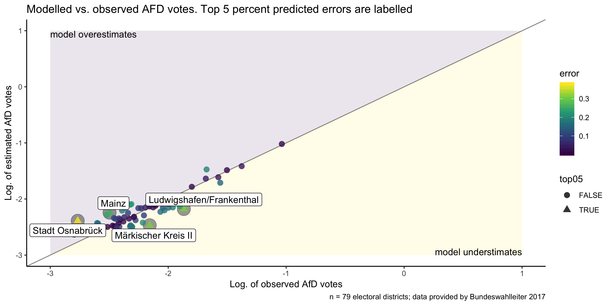
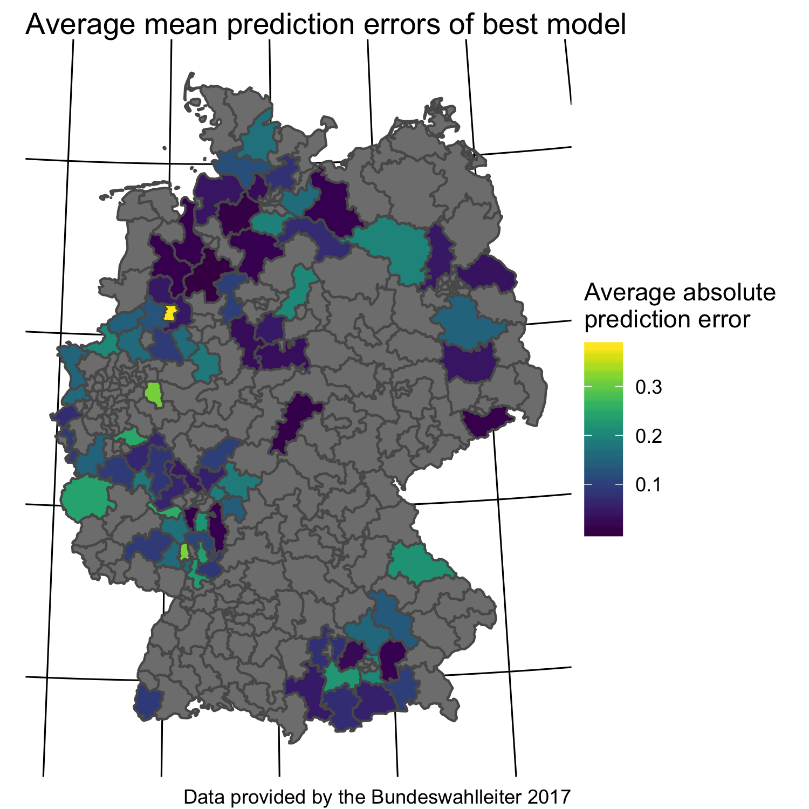

```{r setup, include=FALSE}
options(htmltools.dir.version = FALSE)

knitr::opts_chunk$set(
  comment = "#>",
  collapse = TRUE,
  message = FALSE,
  warning = FALSE,
  error = TRUE,
  cache = TRUE,
  echo = FALSE,
  out.width = "100%",
  fig.align = 'center',
  fig.width = 6,
  fig.asp =  0.618,  # 1 / phi
  fig.show = "hold",
  size = "tiny"
)
```


```{r libs, echo = FALSE}
library(tidyverse)
library(tidyr)
library(DiagrammeR)
library(rethinking)
library(knitr)
library(kableExtra)
library(rprojroot)
```


```{r}
proj_root <- rprojroot::find_root(as.root_criterion(is_rstudio_project))
```


class: center, middle, inverse

# Menace to society

Right-wing populism then and now


---


class: top, left
# Causes of 20th century world wars


- *nationalism*

- authoritarianism

- racism

- territorial disputes

- class conflicts

- crisis of capitalism


.small[.footnote[Source: Kershaw, I. (2016). To hell and back: Europe 1914-1949. New York City, NW: Penguin.]]


???

Image credit:Wikipedia, RIA Novosti archive, image #44732 / Zelma / CC-BY-SA 3.0


---


class: top, left

# Right-wing populism varies greatly, but...


- shows *anti-establishment* attitude

- the *people* is thought of as a *homogeneous body*

- *elites* are portrayed as *corrupt*, the *people* as *morally pure*

- favors *anti-pluralism*

- provides *low complexity solutions* to societal questions

- narrative of *"forgotton man Joe Plumber"*

- sees threat in *cultural outsiders*


.footnote[Source: Decker, F. (2003). Der neue Rechtspopulismus. Wiesbaden: VS Verlag für Sozialwissenschaften. Nicole Berbuir, Marcel Lewandowsky & Jasmin Siri (2015) The AfD and its Sympathisers: Finally a Right-Wing Populist Movement in Germany?, German Politics, 24:2,
154-178, DOI: 10.1080/09644008.2014.982546]


---

# AfD as a nucleus of the German right-wing movement


The AfD ...

- engages in *close contacts to far-right*

- recruits (ex-)*nazis*

- Indirect *support of violence* towards minorities:

>    "Wenn der Staat die Bürger nicht mehr schützen kann,
>    gehen die Menschen auf die Straße und schützen sich selber."

.small[— Tweet by Markus Frohnmaier (@Frohnmaier_AfD) on August, 26th 2018 in reaction to Chemnitz riots]

.footnote[Source: Fuchs, C., & Middelhoff, P. (2018, May 12). Neue Rechte - Bis in den letzten, rechten Winkel. Retrieved from https://www.zeit.de/politik/deutschland/2018-05/neue-rechte-verteilung-deutschlandkarte]


---

class: top, left
# Popular theories on AfD success

Populist party support is fueled by ...

- weak economy ("rust belt hypothesis")

- high immigration ("flooding hypothesis")

- cultural patterns ("Saxonia hypothesis")


.footnote[Source: Franz, Christian; Fratzscher, Marcel; Kritikos, Alexander S. (2018) : German right-wing party AfD finds more support in rural areas with aging populations, DIW Weekly Report, ISSN 2568-7697, Deutsches Institut für Wirtschaftsforschung (DIW), Berlin, Vol. 8, Iss. 7/8, pp. 69-79]


---

# Our research model


.center[
```{r research-model, echo =FALSE, fig.align='center', fig.width = 8, fig.asp =  .81, out.width = "100%"}
  
grViz(
  "digraph research_mdoel {
  
  
  graph [layout = dot,
  rankdir = LR];
  
  node [fontname = Helvetica, fontcolor = darkslategray,
  shape = rectangle, fixedsize = true, width = 3,
  color = darkslategray]; unemployment; foreigners; east_west; personality; AfD


  unemployment -> AfD
  personality -> AfD
  foreigners -> AfD
  east_west -> AfD}"

)
```
]


```{r eval = FALSE}
library(DiagrammeRsvg)
p_pathmodel <- grViz(
  "digraph research_mdoel {
  
  
  graph [layout = dot,
  rankdir = LR];
  
  node [fontname = Helvetica, fontcolor = darkslategray,
  shape = rectangle, fixedsize = true, width = 3,
  color = darkslategray]; unemployment; foreigners; east_west; AfD

  node [fontname = Helvetica, fontcolor = darkslategray,
  shape = circle, fixedsize = true, width = 3,
  color = darkslategray]; economy; immigration; culture

  economy -> unemployment -> AfD
  immigration -> foreigners -> AfD
  culture -> east_west -> AfD}"

)

p_svg <- export_svg(p_pathmodel)

p_svg
write(p_svg, file = "img/p.svg")
dput(p_svg, file = "img/p_pathmodel.svg")
```


---

class: middle, center, inverse

# AfD votes, and socioenomic factors at the Bundestagswahl 2017


---


class: top, left


# Unemployment and AfD votes


```{r unemp, out.width="100%", echo=FALSE}

```
 

---

# Foreigners and AfD votes


```{r foreigner, fig.align="center", out.width="100%", echo=FALSE}

```


---


class: middle, center, inverse

# data analysis


---


class: top, left

# Data preparation


- Election related data were obtained from [Bundeswahlleiter 2017](https://www.bundeswahlleiter.de/bundestagswahlen/2017/ergebnisse.html)

- Personality data (n = 22000) were collected by the authors

- Outcome variable: `afd_votes` (proportion) was log-transformed for better approximation to normality


```{r echo = FALSE, out.width = "60%"}

```


---

# Bayes modeling


- Stan via the R packages `rstan` and `rethinking`

- Hamiltonian Markov Chain Monte Carlo (MCMC)

- 2000 iterations,  2 chains, 1/2 burn-in

- Information criteria (WAIC) were used for model comparison


.footnote[Guideline: McElreath, R. (2016). Statistical rethinking. New York City, NY: Apple Academic Press Inc.]

---

# Model specification


<!-- $$\begin{aligned} -->
<!-- \text{AfD}_i \sim \mathcal{N}(\mu_i, \sigma)\\ -->
<!-- \mu_i = \beta 0_{[east]} + \beta 1 \cdot \text{foreign_z} + \beta2  -->
<!-- \cdot \text{unemp_z} +\\ -->
<!-- \beta3 \cdot \text{enjoyer} + beta4 \cdot \text{harmony_seeker} +\\ -->
<!-- \beta5 \cdot \text{self_determined} + beta6 \cdot \text{appreciater} +\\ -->
<!-- \beta7 \cdot \text{conformist} + beta8 \cdot \text{type_unknown} +\\ -->
<!-- \beta9 \cdot \text{responsibility_denier} \\ -->

<!-- \beta0_{[east]} \sim  \mathcal{N}(0, 1)\\ -->
<!-- \beta1 \dotsc \beta9 \sim  \mathcal{N}(0, 1)\\ -->

<!-- \sigma \sim \mathcal{Cauchy}(0, 1)\\ -->
<!-- \end{aligned}$$ -->


```{r m9-stan, eval = FALSE, echo = TRUE}
# Likelihood:
afd_prop_log_z ~ dnorm(mu, sigma),

# regression:
mu <- beta0[state_id] +  beta1*for_prop_z    + beta2*unemp_prop_z +
  beta3*enjoyer       + beta4*harmony_seeker + beta5*self_determined +
  beta6*appreciater   + beta7*conformist     + beta8*type_unknown +
  beta9*responsibility_denier,

# priors:
sigma  ~ dcauchy(0, 1),
beta1  ~ dnorm(0, 1), beta2 ~ dnorm(0, 1), beta3 ~ dnorm(0, 1),   
beta4  ~ dnorm(0, 1), beta5 ~ dnorm(0, 1), beta6 ~ dnorm(0, 1),
beta7  ~ dnorm(0, 1), beta8 ~ dnorm(0, 1), beta9 ~ dnorm(0, 1),
beta0[state_id] ~ dnorm(0, sigma2),  # multi level
sigma2 ~ dcauchy(0, 1)
```


---


class: middle, center, inverse

# Results

---


# Comparing model errors


```{r pred-error, out.width="100%"}
knitr::include_graphics("img/p_mod_err_boxplots.png")
```

---


# No (strong) evidence of predictive power of our personality data

```{r}
stan_model_comparison_output <- read.csv(paste0(proj_root,"/objects/model_comparison.csv"))

if (nrow(stan_model_comparison_output != 7)) warning("Number of included models is incorrect!")

```


```{r all-models, echo = FALSE}

tibble::tribble(
  ~model,       ~predictors,
  "m0b",         "null model",
   "m1b",       "east + foreign + unemp + personality",
   "m2b",       "east + foreign + unemp",
   "m3b",       "east (ML) + foreign + unemp ",
   "m4b",       "state (ML) + foreign + unemp",
  "m5b",        "state (ML) + foreign + unemp + personality",
  "m6b",        "east (ML) + foreign + unemp + personality"
  
  ) -> model_spec

stan_model_comparison_output %>% 
  full_join(model_spec) %>% 
  mutate_if(is.numeric, round, 2) %>% 
  select(model, predictors, WAIC, pWAIC, SE, weight) %>% 
  arrange(WAIC) -> stan_model_comparison_output2

```


```{r eval = FALSE}
print(xtable::xtable(stan_model_comparison_output2, type = "latex"))
```


```{r model-tabel, echo = FALSE}
stan_model_comparison_output2 %>% 
  knitr::kable() %>% 
  kableExtra:: kable_styling(bootstrap_options = c("striped", "hover")) %>% 
  row_spec(1, bold = T, color = "blue", background = "yellow")
```


.footnote[ML: Multi Level]
---


# Model specification of most favorable model

predictors: state (as multi level) + foreign + unemp

```{r best-model-spec, eval = FALSE, echo = TRUE}
# Likelihood:
afd_prop_log_z ~ dnorm(mu, sigma),  

# regression:
mu <- beta0[state_id] +  beta1*for_prop_z + beta2*unemp_prop_z,

#priors:
beta0[state_id] ~ dnorm(0, sigma2),

sigma  ~ dcauchy(0, 1),
sigma2 ~ dcauchy(0, 1),
beta1  ~ dnorm(0, 1),
beta2  ~ dnorm(0, 1)
```


---

# Coefficients of the most favorable model

predictors: state (as multi level) + foreign + unemp


```{r fav-model, echo=FALSE}

best_model_precis <- read_csv(paste0(proj_root, "/objects/best_model_precis.csv"))

best_model_precis %>% 
  rename(Coefficient = X1) %>% 
  mutate_if(is.numeric, round, digits = 2) %>% 
  DT::datatable(options = list(pageLength = 5))
```


---

# Traceplot of most favorable model

predictors: state (as multi level) + foreign + unemp


```{r m15trace}

```

---


# Checking model additivity assumption of best model

```{r out.width="80%"}
knitr::include_graphics("img/p_best_model_pred_err.png")
```


.footnote[Gelman, A., & Hill, J. (2006). Data analysis using regression and multilevel/hierarchical models. Cambridge university press.]

---

# Posterior distributions of parameters of best model

predictors: state (as multi level) + foreign + unemp


```{r out.width = "100%"}
knitr::include_graphics("img/p-post-best-model.png") 
```


---


# Comparing observed and estimated AfD votes (as to best model)

predictors: state (as multi level) + foreign + unemp

```{r model-obs-est, out.width="100%"}

```


---


# Regional patterns of prediction errors (as to best model)


```{r p-pred-error, out.width="50%"}

```


---

class: middle, center, inverse

# Conclusions

---


class: top, left


# Theoretical implications

- *Region related patterns* appear to play an important role
  - more than unemployment rate and foreigner rate
  - not yet well understood
  - rural? aged society?
  
- The present model is *simplistic*

- (The proposed) personality pattern didn't show strong impact

- Personality data *representative*?

- Let's model *future elections* 

- Pathways of voter behavior remains opaque


.footnote[Nicole Berbuir, Marcel Lewandowsky & Jasmin Siri (2015) The AfD and its Sympathisers: Finally a Right-Wing Populist Movement in Germany?, German Politics, 24:2, 154-178, DOI: 10.1080/09644008.2014.982546]

---


# Statistical implications


- *Observational research* is a very *limited* guide for *causal* interpretations

- *Fitting issues* with *count* models warrant more investigation

- *Overfitting* may be present (and underfitting)

- *Reduced* sample size of electoral disctricts is problematic

---


class: middle, center, inverse

# Thank you

Sebastian Sauer

#### `r icon::fa("github", size = 1)` [sebastiansauer](https://github.com/sebastiansauer)
#### `r icon::fa("link", size = 1)` <https://data-se.netlify.com/>
#### `r icon::fa("envelope", size = 1)` ssauer@posteo.de

 
#### `r icon::fa("file", size = 1)` Get slides here: XXX


CC-BY


